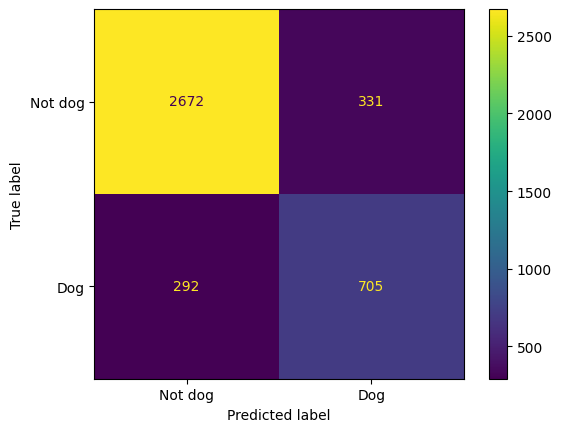

# A simple convolutional neural network (CNN) classifier based on real images of dog


Implementation of a Convolution Neural Network(CNN) Classifier for Classifying dog images. The dataset using for this model is CIFAR-10 and the dataset consists of 60000 32x32 colour images in 10 classes, with 6000 images per class. 
#### Note: This link of dataset is [this](https://www.cs.toronto.edu/~kriz/cifar.html).

### Dependencies
* Jupyter notebook
* PyTorch
* Python 3.6
* Matplotlib
* Seaborn
* Scikit-Learn
* Pandas
* Numpy

#### Test Train Split
I resize the dataset to balance the dataset for the minority class (dog) and split the dataset into 80% train and 20% means test Split each class images into 16,000 for train and 4,000 for test. 

### Architecture


```python
self.conv1 = nn.Conv2d(in_channels=3, out_channels=16, kernel_size=3, stride=1, padding=1)
self.conv2 = nn.Conv2d(in_channels=16, out_channels=32, kernel_size=3, stride=1, padding=1)
self.conv3 = nn.Conv2d(in_channels=32, out_channels=64, kernel_size=3, stride=1, padding=1)
self.conv4 = nn.Conv2d(in_channels=64, out_channels=128, kernel_size=3, stride=1, padding=1)
```

Network Parameter:
* Rectifier Linear Unit (Activation function)
* Adam optimizer
* Sigmoid on final output
* Binary CrossEntropy loss
* Learning rate


```python
criterion = nn.BCELoss() 
optimizer = optim.Adam(cnn.parameters(), lr=0.001, weight_decay=1e-5)
scheduler = torch.optim.lr_scheduler.StepLR(optimizer, step_size=5, gamma=0.5)
```

## Data Augmentation
Using data augmentation techniques to increase the data.
* Random horizontal flip
* Random rotation
* Color jitter

```python
def get_data_augmentation():
    return transforms.Compose([
        transforms.RandomHorizontalFlip(),  # Flip orizzontale casuale
        transforms.RandomRotation(10),  # Rotazione casuale fino a 10 gradi
        transforms.ColorJitter(brightness=0.2, contrast=0.2, saturation=0.2, hue=0.1),  # Variazioni di colore
        transforms.ToTensor(),
        transforms.Normalize((0.5,), (0.5,))  # Normalizzazione
    ])
```

### Predictions of the images


### Visualization of Layers Input


### Visualization of first covolution layer output


### Visualization of second covolution layer output


### Visualization of third covolution layer output


### Visualization of fourth covolution layer output


### Model performance on new data
For the classification of images, the result are:
* Image 1: 99.92% of probability that is a Not dog
* Image 2: 100.00% of probability that is a Dog
* Image 3: 98.00% of probability that is a Dog
* Image 4: 100.00% of probability that is a Dog
* Image 5: 100.00% of probability that is a Dog

Confusion Matrix
